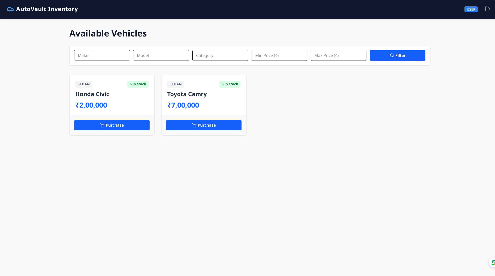
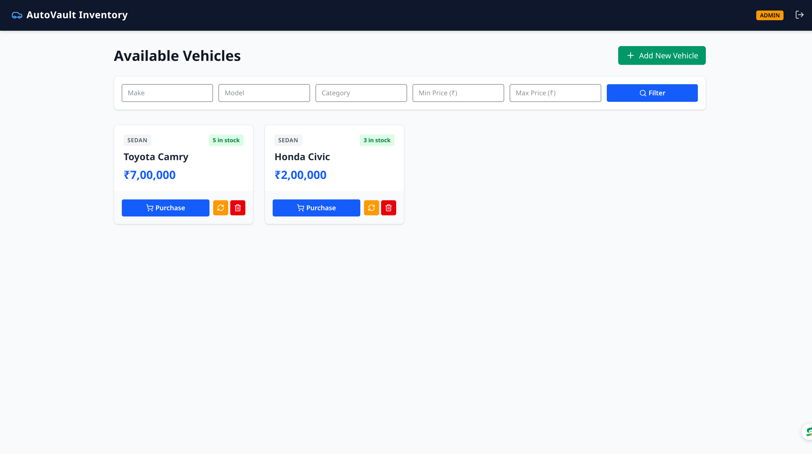
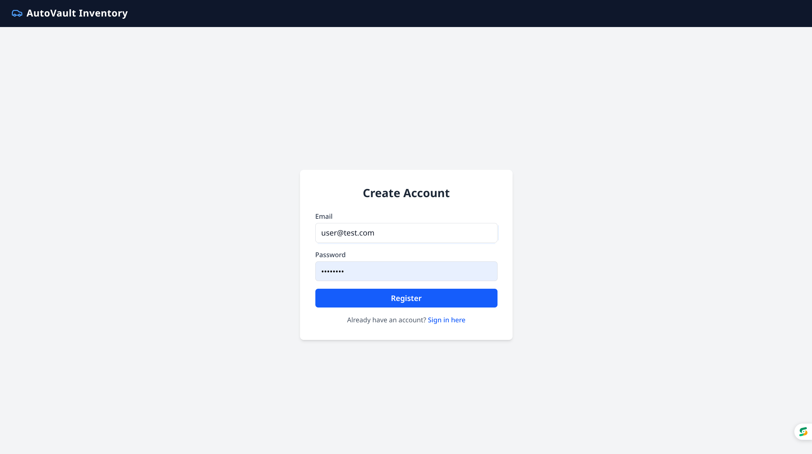
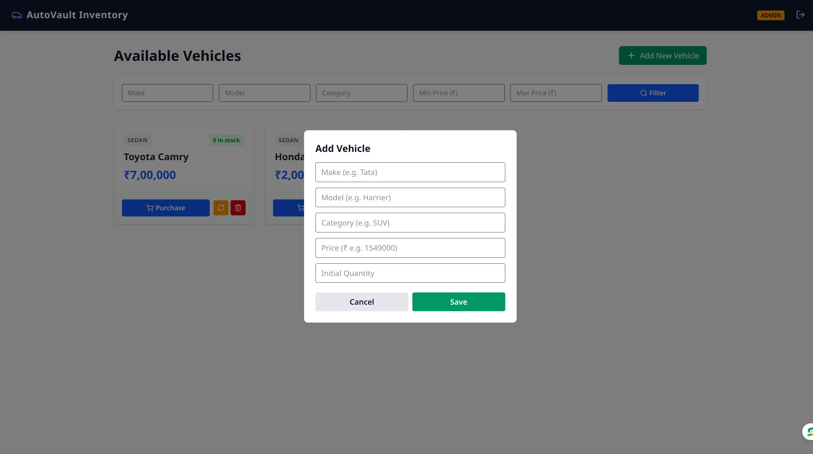
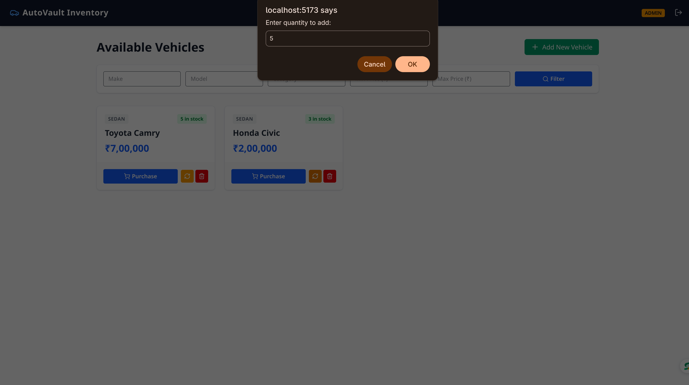
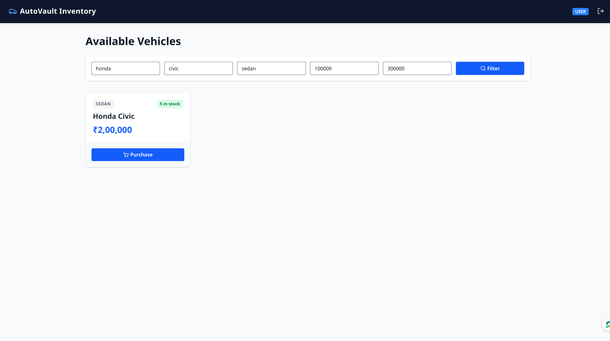

# 🏎️ Car Dealership Inventory System

A modern, full-stack Car Dealership Inventory Management System built using **Node.js, Express, TypeScript, MongoDB, React, and Tailwind CSS**.

This project was developed strictly following **Test-Driven Development (TDD)** practices (Red-Green-Refactor) and demonstrates clean coding principles, secure JWT authentication, dynamic vehicle search/filtering, inventory control, and role-based access control (RBAC).

---

## 📸 Application Screenshots

## 1. User Dashboard


_Displays available vehicles with dynamic stock badges and purchase triggers._

### 2. Admin Dashboard


_Admin-only controls to manage, update, and oversee inventory listings._

### 3. User Login


_Secure login interface for existing users._

### 4. User Registration


_Registration page for new user account creation._

### 5. Add New Vehicle


_Form interface for administrators to add new vehicle models to the inventory._

### 6. Restock Vehicle Inventory


_Admin modal to increment existing vehicle stock levels._

### 7. Vehicle Search & Filter


_Real-time vehicle filtering by make, model, category, and price parameters._

---

## ✨ Features

### Backend (RESTful API)

- **JWT Authentication:** Secure user registration, login, and token verification.
- **Role-Based Authorization:** Protected routes ensuring regular users can purchase items while only Admins can create, update, restock, or delete vehicles.
- **TDD & High Test Coverage:** Built test-first using Jest and Supertest.
- **Inventory Management:** Atomic decrement on purchase and increment on restock operations.
- **Flexible Search API:** Filter vehicles dynamically by make, model, category, or price range.

### Frontend (SPA)

- **Modern UI:** Responsive layout built with React, TypeScript, and Tailwind CSS.
- **Context API:** Global state management for authentication tokens and user roles.
- **Interactive Dashboard:** Cards with real-time stock indicators (automatically disables purchase buttons when out of stock).
- **Admin Interface:** Modal/Form options for updating stock levels and managing catalog items.

---

## 🛠️ Tech Stack

- **Backend:** Node.js, Express, TypeScript, MongoDB, Mongoose, JWT, Bcrypt, Jest, Supertest
- **Frontend:** React, TypeScript, Tailwind CSS, Lucide Icons, Axios / Fetch API
- **Tooling & Workflow:** Git, npm, VS Code Copilot, ChatGPT, Gemini

---

## 🚀 Getting Started Locally

### Prerequisites

Make sure you have the following installed on your machine:

- [Node.js](https://nodejs.org/) (v18.x or higher)
- [npm](https://www.npmjs.com/) (v9.x or higher)
- [MongoDB](https://www.mongodb.com/) (Local instance or MongoDB Atlas URI)

---

### 1. Clone the Repository

````bash
git clone [https://github.com/Bedant186/car-inventory.git](https://github.com/Bedant186/car-inventory.git)
cd car-inventory


---

# ⚙️ Backend Setup & Local Run

## 1. Navigate to Backend Directory

```bash
cd backend
````

---

## 2. Install Backend Dependencies

```bash
npm install
```

---

## 3. Create Environment Variables

Create a `.env` file inside the backend root directory:

```env
PORT=5000
MONGO_URI=mongodb://localhost:27017/car-inventory
JWT_SECRET=your_jwt_secret_key_here
NODE_ENV=development
```

---

## 4. Run Database Seed (If Available)

```bash
npm run seed
```

---

## 5. Start Backend Server

```bash
npm run dev
```

Backend API will be available at:

```
http://localhost:5000
```

---

# 🎨 Frontend Setup & Local Run

## 1. Navigate to Frontend Directory

Open another terminal:

```bash
cd frontend
```

---

## 2. Install Frontend Dependencies

```bash
npm install
```

---

## 3. Create Frontend Environment Variables

Create a `.env` file inside the frontend root directory:

```env
VITE_API_BASE_URL=http://localhost:5000/api
```

---

## 4. Start Frontend Development Server

```bash
npm run dev
```

The application will be accessible at:

```
http://localhost:5173
```

(or the URL shown in the terminal)

---

# 🧪 Running Tests

This project follows a **Test-Driven Development (TDD)** approach.

---

# Backend Tests

Navigate to backend:

```bash
cd backend
```

Run tests:

```bash
npm test
```

---

## Backend Test Coverage

Generate test coverage report:

```bash
npm run test:coverage
```

---

# Frontend Tests

Navigate to frontend:

```bash
cd frontend
```

Run tests:

```bash
npm test
```

---

# 📑 API Documentation

Base API URL:

```
http://localhost:5000/api
```

---

# 🔐 Authentication APIs

| Method | Endpoint             | Description                             | Access |
| ------ | -------------------- | --------------------------------------- | ------ |
| POST   | `/api/auth/register` | Register a new user                     | Public |
| POST   | `/api/auth/login`    | Authenticate user and receive JWT token | Public |

---

# 🚘 Vehicle APIs

| Method | Endpoint               | Description                                 | Access    |
| ------ | ---------------------- | ------------------------------------------- | --------- |
| GET    | `/api/vehicles`        | Get all vehicles                            | Protected |
| GET    | `/api/vehicles/search` | Search vehicles by make, model, price, etc. | Protected |
| POST   | `/api/vehicles`        | Add a new vehicle                           | Admin     |
| PUT    | `/api/vehicles/:id`    | Update vehicle details                      | Admin     |
| DELETE | `/api/vehicles/:id`    | Delete a vehicle listing                    | Admin     |

---

# 📦 Inventory APIs

| Method | Endpoint                     | Description                         | Access    |
| ------ | ---------------------------- | ----------------------------------- | --------- |
| POST   | `/api/vehicles/:id/purchase` | Purchase vehicle and decrease stock | Protected |
| POST   | `/api/vehicles/:id/restock`  | Restock vehicle and increase stock  | Admin     |

---

# 🔑 Authorization

Protected routes require a JWT token.

Include the token in request headers:

```http
Authorization: Bearer <JWT_TOKEN>
```

---

# 🏗️ Project Structure

```
car-inventory/
│
├── backend/
│   ├── src/
│   ├── tests/
│   ├── .env
│   └── package.json
│
├── frontend/
│   ├── src/
│   ├── tests/
│   ├── .env
│   └── package.json
│
└── README.md
```

---

# 🛠️ Technology Stack

## Backend

- Node.js
- Express.js
- MongoDB
- JWT Authentication
- Jest
- Supertest

## Frontend

- React
- Vite
- React Testing Library

---

# 🚀 Running the Complete Application

## Start Backend

```bash
cd backend
npm install
npm run dev
```

Backend runs on:

```
http://localhost:5000
```

---

## Start Frontend

Open another terminal:

```bash
cd frontend
npm install
npm run dev
```

Frontend runs on:

```
http://localhost:5173
```

---

# ✅ Development Workflow (TDD)

1. Write tests first
2. Implement required functionality
3. Run backend and frontend test suites
4. Refactor and improve code quality
5. Verify API and frontend integration

---

## My AI Usage

### AI Tools Utilized

1. **Gemini**: Used for initial architecture planning, drafting TDD backend test scenarios, and designing clean Tailwind CSS layout structures for frontend components.
2. **ChatGPT**: Assisted with structuring authentication flows, JWT token management via React Context API, and configuring test runner environments (Jest/Supertest).
3. **GitHub Copilot**: Used as an inline coding assistant during development for quick syntax autocompletion, TypeScript type declarations, and query syntax.

---

### How AI was Integrated into the Workflow

- **Test-Driven Development (TDD):** AI models were asked to generate test suites _before_ backend endpoints were written. This ensured a strict Red-Green-Refactor development methodology throughout the commit history (e.g., `test(vehicle): add failing vehicle creation tests` followed by `feat(vehicle): implement vehicle creation endpoint`).
- **Boilerplate Acceleration:** AI provided baseline setups for configuration files (`tsconfig.json`, `jest.config.js`) and database schema models, saving time on repetitive setup.
- **Frontend UI Design:** Gemini provided responsive layout ideas using Tailwind CSS classes for the car catalog, filter bar, and status indicators.

---

### Reflection on AI Impact

Leveraging AI tools significantly increased development speed while maintaining high code quality and test coverage. Using AI to generate initial test suites enforced strict TDD principles without spending excess time writing standard mock declarations manually. However, human intervention remained critical—specifically for debugging Express middleware edge cases, refining custom search queries, and verifying strict role-based access controls for backend routes.
